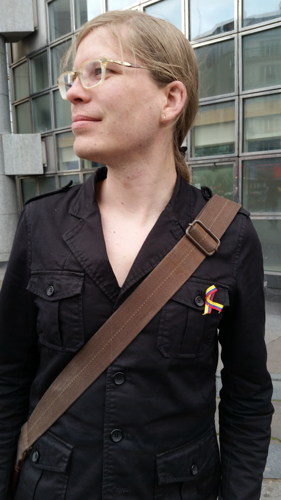

:title: About Me
:slug: about
:header_cover: images/about/about-bg.jpg

Erik Madison Bray
-----------------

- M.S. Applied Physics—Johns Hopkins University
- B.S. Computer Science, B.A. Japanese Language and Literature—Universityof Massachusetts, Amherst

I am a software engineer mostly interested in open source science, and
particularly the scientific Python community (though not limited to Python).
Currently my primary work is improving packaging and plumbing of the
`SageMath`_ open source mathematics software system, with funding from the
`OpenDreamKit`_ project.

You may know me from my previous role at the `Space Telescope Science
Institute`_, where I worked on data reduction software for the `Hubble Space
Telescope`_ and the upcoming `James Webb Space Telescope`_, and was a core
contributor to the `Astropy`_ project.  I also occasionally moonlight as a
volunteer instructor for `Software Carpentry`_, where I help researchers and
students from accross disciplines learn software development skills.

Prior to that I did some hacking for shady three-letter agencies.

I live in Orsay, France with my partner Irina and our two cats.  In my free
time I like playing with the cats, playing Beat Saber, trying to learn
French, and working to obtain my private pilot's license. In the past I've
also lived in Japan and Mexico, and have basic competence in Japanese and
Spanish (French I'm still working on).  My first name is Erik, but since I
have come out as non-binary and transfemme I use my middle name Madison more
often, but in the wild you will encounter both. Pronouns: they/them.

Publications
------------

* P. Greenfield, M. Droettboom, E.M. Bray
  `ASDF: A new data format for astronomy <http://www.sciencedirect.com/science/article/pii/S2213133715000645>`_
  Astron. Comp., 12 (2015), pp. 240–251
* B. Thomas, et al.
  `Learning from FITS: Limitations in use in modern astronomical research <http://www.sciencedirect.com/science/article/pii/S2213133715000104>`_
  Astron. Comput. (2015) http://dx.doi.org/10.1016/j.ascom.2015.01.009 arXiv:1502.00996v2
* Astropy Collaboration
  `Astropy: A community python package for astronomy <http://www.aanda.org/articles/aa/abs/2013/10/aa22068-13/aa22068-13.html>`_
  Astron. Astrophys., 558 (2013), p. A33 http://dx.doi.org/10.1051/0004-6361/201322068 arXiv:1307.6212

.. important::

    This site is for my personal writings on software and other topics—all
    opinions expressed are my own and not representative of any organizations
    or projects I work for unless explicitly stated otherwise.

.. _SageMath: http://www.sagemath.org/
.. _OpenDreamKit: http://opendreamkit.org/
.. _Space Telescope Science Institute: http://www.stsci.edu
.. _Hubble Space Telescope: http://hubblesite.org/
.. _James Webb Space Telescope: http://webbtelescope.org/webb_telescope/
.. _Astropy: http://www.astropy.org/
.. _Software Carpentry: http://software-carpentry.org/
